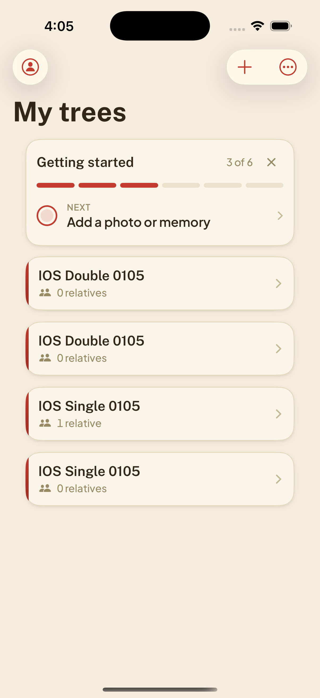
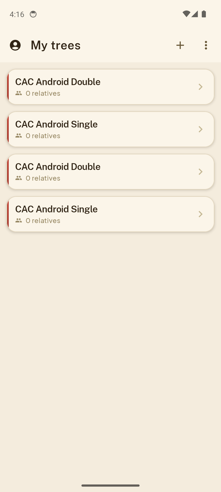

<h1 align="center">CodeAndConfirm</h1>

<p align="center"></p>

<h2 align="center">One agent builds, the other tries to break it.</h2>

Claude writes the code. Codex opens your iOS and Android apps, exercises user flows, and reports what breaks. Review a branch or an existing PR with screenshots, test results, and a verdict tied to the tested commit.

A community project, not an official Anthropic or OpenAI product.

## See it catch a bug

An intentionally broken demo branch created every tree twice. Codex tested both
apps, compared them with the base build, and found two persisted records where
there should be one. The gate returned **FAIL**.

| iOS Simulator | Android Emulator |
|:---:|:---:|
|  |  |

Actual screenshots from a recorded QA run with synthetic names. [Base comparison, results, and source evidence](docs/demo.md).

## Install and configure

### Give this to your agent

> Set up CodeAndConfirm for this app repository. Read and follow
> https://github.com/Tatendaz/codeandconfirm/blob/main/docs/agent-setup.md.
> Inspect the project, install missing tools with my approval, configure QA, and verify a first run.
> Preserve existing settings. Ask me for logins or decisions you cannot infer. Do not merge or publish anything.

The [agent setup guide](docs/agent-setup.md) covers discovery, device setup, configuration,
Claude integration, and verification. Prefer manual setup? Start below.

**Alpha, macOS first.** Tested on Apple silicon with iOS Simulator and Android Emulator.
You need Python 3.11+, `uv`, Xcode and `idb`, Android SDK and your app's JDK, and a
signed-in Codex CLI with access to your configured model. Add Claude Code for the
coding-agent workflow and `gh` for PRs. [Tool setup](docs/quickstart.md#1-install).

```bash
git clone https://github.com/Tatendaz/codeandconfirm.git
cd codeandconfirm
uv tool install .
codeandconfirm --version
```

From the app repository you want to test:

```bash
cd /path/to/your/app-repo
codeandconfirm init --devices
```

Edit the generated `codeandconfirm.toml` for your app's build commands, artifacts,
identifiers, suites, backend, and required journeys. Then run `codeandconfirm doctor`.
This setup is required. [Walkthrough](docs/quickstart.md) · [Example config](examples/firebase-two-app.toml).

Trusted-candidate QA runs unsandboxed and executes build scripts. Read the
[trust boundaries](docs/trust-boundaries.md) first. Fork PRs get static-only review by default.

## Review a branch or existing PR

Commit your change first. Create `criteria.md` with the behaviors to check:

```markdown
- Creating a tree produces exactly one row and one backend record.
- Rapid Create taps do not create duplicates or open an older tree.
- Created data survives an app restart.
```

From the configured app repository, choose one:

```bash
# Current branch
codeandconfirm review --branch "$(git branch --show-current)" --base main --criteria-file criteria.md

# Existing PR, replacing the example URL
codeandconfirm review --pr https://github.com/owner/repo/pull/123 --criteria-file criteria.md
```

Both use isolated worktrees. Add `--merge-candidate` to test a PR's merge candidate,
or `--publish` to post the report and commit status. Reports stay local by default.
Use `codeandconfirm report <run-id>` to read the result.

## Let Claude request QA

After [agent-led setup](docs/agent-setup.md) or [manual skill installation](docs/quickstart.md#6-from-claude-code), tell Claude:

> Implement this change, then use /codeandconfirm before opening the PR.
> Fix blocking findings and rerun QA. Stop after five repair cycles. Do not merge.

The skill guides the repair loop. For enforcement, use the [pre-PR hook](hooks/pre-pr-gate.sh)
and [server-side check](docs/server-side-check.md). [Codex can also be the lead](skills/codeandconfirm/for-codex-lead.md).

## Understand the result

The gate checks native-suite results, required journeys, build identity, model identity,
and evidence. It returns PASS, FAIL, BLOCKED, or CANCELLED. **PASS does not mean bug-free.**
The [sample report](docs/sample-report.md) passed its policy with two non-blocking findings.
Every new commit needs a new verdict. [Workflow, diagram, and verdict rules](docs/review-workflow.md).

iOS and Android functional QA can run in parallel with device-scoped input.
Performance benchmarks run separately on an idle host. Startup and memory checks
are preliminary; they do not certify physical-device speed or frame pacing.
[Performance limits](docs/performance.md) · [Detected startup regression](examples/perf-regression.md).

Artifacts are local, but selected code, UI context, and screenshots reach the model provider.
[Costs and data handling](docs/costs.md) explain usage, publication, and privacy.

## Documentation and contributing

[Quickstart](docs/quickstart.md) · [Configuration](docs/configuration.md) · [Troubleshooting](docs/troubleshooting.md)

[Device adapters](docs/adapters.md) · [Demonstrations](docs/demonstrations.md) · [Weekly runs](examples/weekly/)

[Real development backend](docs/real-backend.md) · [Publish findings](docs/publish-issues.md) · [Migration](docs/migration.md)

Contributions welcome. [Development setup](CONTRIBUTING.md) · [Apache-2.0 license](LICENSE).

Maintained by Tatenda Zhou (<tatendaz@me.com>).
