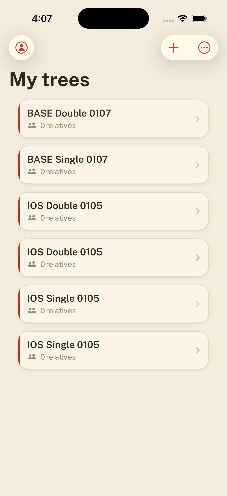
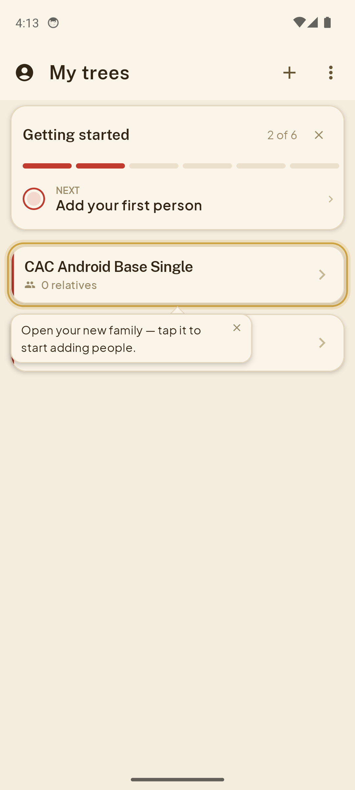

# Demo: catching duplicate records on iOS and Android

One create intent should produce one tree. An intentionally broken branch added
a second create call on both platforms. CodeAndConfirm built and installed the
apps, ran native suites, and launched Codex workers to test the UI through
`ccdevice`. The workers compared the candidate with the base and inspected the
local Firebase emulator's records. The gate returned **FAIL**.

This page packages a recorded run from September 6, 2026. No new mobile QA run was
performed to create this page. The screenshots below are original, unedited PNGs,
displayed smaller in Markdown. They show synthetic test data in the reference
family-tree app, not generated mockups or a video of live actions.

## Candidate: two records per creation

| iOS Simulator | Android Emulator |
|:---:|:---:|
|  |  |

The iOS capture is after an app restart. The Android capture is after the base
comparison, candidate restoration, and an offline check. Both show persisted
duplicates. Each platform tested one normal submission and one rapid double-tap
submission using different names. Each name produced two distinct backend records.

## Base comparison: one record per creation

| iOS base | Android base |
|:---:|:---:|
|  |  |

On iOS, inspect the two rows prefixed `BASE` at the top. Older candidate records
remain below them because changing the installed build does not remove backend
data. Android used a fresh test account; its coach mark obscures the second row.
The backend counts below establish uniqueness independently of those UI details.

| Platform / submission | Candidate records | Base records |
|---|---:|---:|
| iOS, single tap | 2 | 1 |
| iOS, rapid double tap | 2 | 1 |
| Android, single tap | 2 | 1 |
| Android, rapid double tap | 2 | 1 |

## Result and reproduction

Edited report excerpt, with identifiers omitted:

```text
Gate: FAIL
Candidate and base: pinned; candidate checkout unmodified
Installed identity: verified on iOS and Android
iOS smoke:         0/2 passed
Android smoke:     1/2 passed
Mock-server suite: 34/34 passed
tree.create-once:  FAILED on both platforms
Blocking findings: 3 reports of the duplicate-create defect
```

The three blocking findings came from the review, iOS, and Android workers. They
corroborate the same planted defect; they are not three independent bugs.

1. Install the intentionally broken candidate on a dedicated test device.
2. Sign in with a synthetic account and open My trees.
3. Create a uniquely named tree with one tap on Create.
4. Check the list and backend. The candidate creates two records.
5. Repeat with another name and two Create taps, 80 ms apart.
6. Install the base and repeat with fresh names. Each name has one record.
7. Restore the candidate and verify its installed identity before ending QA.

Do not introduce this fault into a real release branch. To test your own app,
configure it using the [quickstart](quickstart.md), commit your candidate, and run
`codeandconfirm review --branch <branch> --base main --criteria-file criteria.md`.

## Provenance

- Run: `20260906-005526-69f052`, started at 00:55:26 UTC.
- Candidate: `129ce07d8200d59ea939c0e1c6fde46825498930`, intentionally broken demo branch.
- Base: `e5eaa0667d39b45723c8fe2cd6cc3e91b11f452e`.
- Environment: macOS on Apple silicon, iOS Simulator and Android 14 Emulator,
  local Firebase emulator. No production backend.
- Worker model: `gpt-6-astra`, verified in the recorded run; Codex CLI 0.153.4.
- Capture names, UTC timestamps, file hashes, and summarized backend counts are in
  [evidence.json](media/duplicate-tree/evidence.json).

Original sources remain in the operator's local archive under
`$CODEANDCONFIRM_HOME/runs/20260906-005526-69f052/`. This repository includes only
the four reviewed screenshots and a selected metadata/count summary, not raw
transcripts, credentials, account IDs, backend document IDs, or build artifacts.
The archive is not bundled, so the published summary is not independently
re-executable proof. File hashes identify the included images, not the truth of
the test outcome.

## What this demo does not prove

This demonstrates detection of one injected data-integrity defect. It does not
certify all user flows, accessibility, production behavior, or physical-device
performance. The screenshots are selected states, not a continuous action recording.

A separate [startup regression example](../examples/perf-regression.md) records
controlled base/candidate timings. Those measurements were not taken during this
functional run. See [performance limits](performance.md) before treating a QA PASS
as a performance guarantee.
